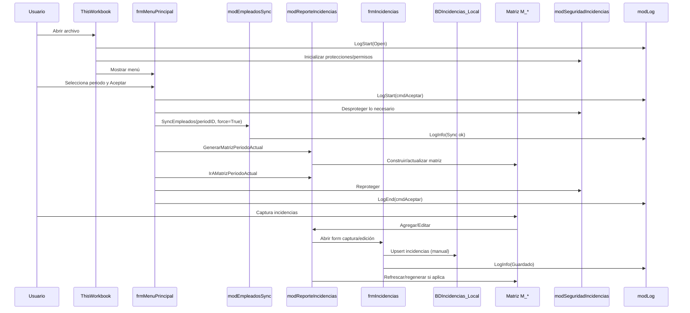
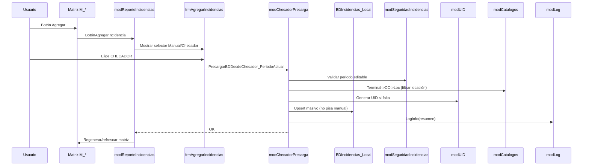

# 01 — MAPA DEL SISTEMA

## Objetivo
Este documento permite que cualquier persona técnica (o tú mismo en 6 meses):
- Entienda el sistema completo
- Sepa qué módulo hace qué
- Evite duplicar lógica
- Sepa dónde tocar y dónde NO tocar

---

## Visión general del sistema

Flujo principal (macro-nivel):

Workbook_Open  
→ frmMenuPrincipal  
→ Sync empleados  
→ Generar matriz  
→ Captura incidencias  
→ (Opcional) Precarga checador  
→ Cierre de periodo  

---

## Variables globales críticas
(definidas principalmente en `ModGlobal`)

- gLoc
- gAnio
- gMes
- gTipoPeriodo
- gPeriodo
- periodID
- gIsTemplate

Estas variables definen **el contexto completo del sistema**.

---

## Catálogo REAL de módulos (según export VBA)

### 🔴 CORE DEL SISTEMA (alto riesgo)

#### ModGlobal
**Responsabilidad:** Variables globales y helpers base  
**Riesgo:** Alto  
**Notas:** Cambios aquí afectan todo el sistema.

---

#### modConfig
**Responsabilidad:** Lectura y escritura de configuración (`tblConfig`)  
**Funciones clave:** GetConfig, SetConfig  
**Riesgo:** Alto  
**Regla:** Nunca duplicar lógica de configuración fuera de este módulo.

---

#### modPeriodos
**Responsabilidad:** Lógica de periodos (validación, rangos, tipos)  
**Riesgo:** Alto  
**Usado por:** menú, checador, seguridad.

---

#### modReporteIncidencias
**Responsabilidad:** Generar y navegar matrices de incidencias  
**Funciones clave:**
- GenerarMatrizPeriodoActual
- IrAMatrizPeriodoActual  
**Riesgo:** Alto

---

#### modSeguridadIncidencias
**Responsabilidad:** Seguridad y control de edición  
**Funciones clave:**
- PermiteEdicionPeriodo
- ProtegerHojaMatriz
- SafeProtectSheets  
**Riesgo:** Alto

---

### 🟠 EMPLEADOS

#### modEmpleadosSync
**Responsabilidad:** Sincronización de empleados  
**Modos:**
- Local (tabla inyectada)
- Externo (archivo RH, si aplica)  
**Funciones clave:**
- SyncEmpleados_PeriodoActual
- BuildPeriodID  
**Riesgo:** Alto

---

#### modRefreshEmpleados
**Responsabilidad:** Refrescar empleados ya existentes  
**Riesgo:** Medio

---

#### modPushEmpleados
**Responsabilidad:** Empujar empleados a estructuras locales  
**Riesgo:** Medio

---

#### modEmpleadosEliminados
**Responsabilidad:** Manejo de empleados dados de baja  
**Riesgo:** Medio

---

### 🟡 INCIDENCIAS / CATÁLOGOS

#### modCatalogoIncidencias
**Responsabilidad:** Catálogo de tipos de incidencias  
**Riesgo:** Medio

---

#### modCatalogosPuestoActividad
**Responsabilidad:** Catálogo puesto / actividad  
**Riesgo:** Medio

---

#### modCachePuestoActividad
**Responsabilidad:** Cacheo de valores únicos (combos)  
**Riesgo:** Medio

---

#### modUID
**Responsabilidad:** Generación de identificadores únicos  
**Función clave:** BuildUID_Incidencia  
**Riesgo:** Medio

---

### 🟢 CHECADOR (locaciones específicas)

#### modChecadorLectura
**Responsabilidad:** Lectura del archivo de checador  
**Riesgo:** Medio

---

#### modChecadorPrecarga
**Responsabilidad:** Precarga del checador a BDIncidencias_Local  
**Riesgo:** Alto  
**Regla:** El checador SOLO pisa registros marcados como CHECADOR.

---

### 🔵 CALENDARIO / FECHAS

#### modCalendario
**Responsabilidad:** Manejo de fechas, días, rangos  
**Riesgo:** Medio

---

### 🟣 GENERACIÓN / MANTENIMIENTO

#### modGeneradorLocaciones
**Responsabilidad:** Generar archivos por locación  
**Riesgo:** Alto

---

#### modUpdaterLocaciones
**Responsabilidad:** Actualizar archivos de locación existentes  
**Riesgo:** Alto

---

#### modMantenimientoMatrices
**Responsabilidad:** Limpieza y mantenimiento de matrices  
**Riesgo:** Medio

---

### ⚪ ADMIN / UTILIDADES

#### modAdmin
**Responsabilidad:** Funciones administrativas internas  
**Riesgo:** Bajo

---

#### modAutoFixPaths
**Responsabilidad:** Corregir rutas automáticamente  
**Riesgo:** Medio

---

#### modExportVBA
**Responsabilidad:** Exportación del código VBA  
**Riesgo:** Bajo

---

#### modGeneradorTests
**Responsabilidad:** Generación de datos / pruebas internas  
**Riesgo:** Bajo

---

### 🖥️ FORMULARIOS (UI)

- frmMenuPrincipal — selección de periodo
- frmIncidencias — captura principal
- frmAgregarIncidencias — alta directa
- frmOpciones — opciones/configuración

**Regla UI:**  
Los forms NO deben contener reglas de negocio complejas.

---

## Reglas de arquitectura (no negociables)

- Un módulo = una responsabilidad
- No duplicar lógica entre módulos
- Forms = UI, no negocio
- Configuración solo vía modConfig

---

## 🧠 Diagrama lógico del sistema (arquitectura general)

```mermaid
flowchart TB
  subgraph UI["CAPA UI (Forms / Interacción)"]
    MP["frmMenuPrincipal\n(Seleccionar periodo)"]
    FI["frmIncidencias\n(Captura/Edición)"]
    FAI["frmAgregarIncidencias\n(Manual vs Checador)"]
    FO["frmOpciones\n(Opciones avanzadas)"]
  end

  subgraph ENTRY["ENTRADAS / ARRANQUE"]
    WB["ThisWorkbook.Workbook_Open\n(Arranque + Autofix + Seguridad)"]
  end

  subgraph CORE["CORE (Orquestación / Negocio)"]
    RI["modReporteIncidencias\n(Matriz, Botones, Completar, Cerrar)"]
    CHK["modChecadorPrecarga\n(UPSERT checador a BD)"]
    ESYNC["modEmpleadosSync\n(Sync/Modo local/Cache)"]
  end

  subgraph SERVICES["SERVICIOS DE INFRAESTRUCTURA"]
    CFG["modConfig\n(GetConfig/SetConfig)"]
    PER["modPeriodos\n(Rangos de periodo)"]
    SEC["modSeguridadIncidencias\n(Protección + Permisos periodo)"]
    UID["modUID\n(UID incidencias)"]
    CAL["modCalendario\n(Reglas de fechas)"]
    CATI["modCatalogoIncidencias\n(Códigos activos)"]
    CATG["modCatalogos\n(Terminal->CC->Loc)"]
    CACHE["modCachePuestoActividad\n(Cache Puesto/Actividad)"]
    PATH["modAutoFixPaths\n(Autofix rutas)"]
    LOG["modLog\n(Log silencioso)"]
    GLOB["ModGlobal\n(gLoc,gAnio,gMes,gTipoPeriodo,gPeriodo,flags)"]
  end

  subgraph DATA["DATOS (Hojas/Tablas dentro del workbook)"]
    TCFG["Hoja Config / tblConfig"]
    EMP["Hoja Empleados / tblEmpleados_Local\n(+ Empleados_Temp)"]
    BD["Hoja BDIncidencias_Local\n(tabla base)"]
    MAT["Hojas Matriz: M_LOC_YYYY_MM_Q#\n(captura por día)"]
  end

  subgraph TOOL["TOOLING / ADMIN (no operativo diario)"]
    GEN["modGeneradorLocaciones\n(genera 62 archivos)"]
    UPD["modUpdaterLocaciones\n(actualiza archivos ya generados)"]
    ADM["modAdmin\n(macros admin)"]
    EXP["modExportVBA\n(export módulos)"]
    MTTO["modMantenimientoMatrices\n(reparación/limpieza)"]
    TST["modGeneradorTests\n(pruebas)"]
  end

  WB --> PATH
  WB --> CFG
  WB --> SEC
  WB --> MP
  WB --> LOG
  WB --> GLOB

  MP --> CFG
  MP --> SEC
  MP --> ESYNC
  MP --> RI

  ESYNC --> CFG
  ESYNC --> EMP
  ESYNC --> CACHE
  ESYNC --> LOG

  RI --> PER
  RI --> CAL
  RI --> CATI
  RI --> UID
  RI --> SEC
  RI --> CFG
  RI --> BD
  RI --> MAT
  RI --> FI
  RI --> FO
  RI --> FAI
  RI --> LOG

  FAI --> CHK
  CHK --> CATG
  CHK --> PER
  CHK --> UID
  CHK --> SEC
  CHK --> CFG
  CHK --> BD
  CHK --> MAT
  CHK --> LOG

  FI --> CATI
  FI --> UID
  FI --> SEC
  FI --> CFG
  FI --> EMP
  FI --> BD
  FI --> LOG

  CFG --> TCFG
  GEN --> CFG
  GEN --> ESYNC
  GEN --> SEC
  UPD --> CFG
  UPD --> SEC
```

